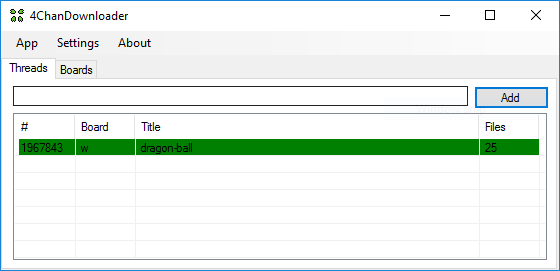

#  4ChanDownloader
Download boards and threads from 4Chan. (Images/Webms/HTML Page)

New ideas, improvements or bug fix's are always welcome.

# Screenshots

# Features
- Download threads (all files and page)
- Download boards
- Watch for changes on the threads and boards
- Ability to save the URL's when the application is closed
- Proxy support
- Easy to customize and use

# Releases
[4ChanDownloader - 1.1.0](https://github.com/carloswbarros/4ChanDownloader/releases/tag/1.1.0)
[4ChanDownloader - 1.0.0](https://github.com/carloswbarros/4ChanDownloader/releases/tag/1.0.0)

# Required packages
- Newtonsoft.Json

# TODO
- [x] The ability of choosing to minimize normally or to the system tray (taskbar)
- [x] Improve download page by downloading the thumbnails and change the urls to work local
- [x] Proxy support
- [ ] Organize the download of boards by creating a small database

# License
MIT License

Copyright (c) [2016] [Carlos Barros]

Permission is hereby granted, free of charge, to any person obtaining a copy
of this software and associated documentation files (the "Software"), to deal
in the Software without restriction, including without limitation the rights
to use, copy, modify, merge, publish, distribute, sublicense, and/or sell
copies of the Software, and to permit persons to whom the Software is
furnished to do so, subject to the following conditions:

The above copyright notice and this permission notice shall be included in all
copies or substantial portions of the Software.

THE SOFTWARE IS PROVIDED "AS IS", WITHOUT WARRANTY OF ANY KIND, EXPRESS OR
IMPLIED, INCLUDING BUT NOT LIMITED TO THE WARRANTIES OF MERCHANTABILITY,
FITNESS FOR A PARTICULAR PURPOSE AND NONINFRINGEMENT. IN NO EVENT SHALL THE
AUTHORS OR COPYRIGHT HOLDERS BE LIABLE FOR ANY CLAIM, DAMAGES OR OTHER
LIABILITY, WHETHER IN AN ACTION OF CONTRACT, TORT OR OTHERWISE, ARISING FROM,
OUT OF OR IN CONNECTION WITH THE SOFTWARE OR THE USE OR OTHER DEALINGS IN THE
SOFTWARE.
